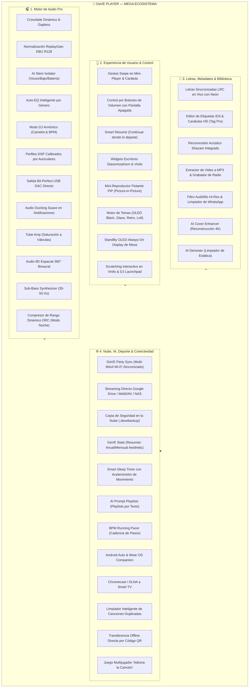
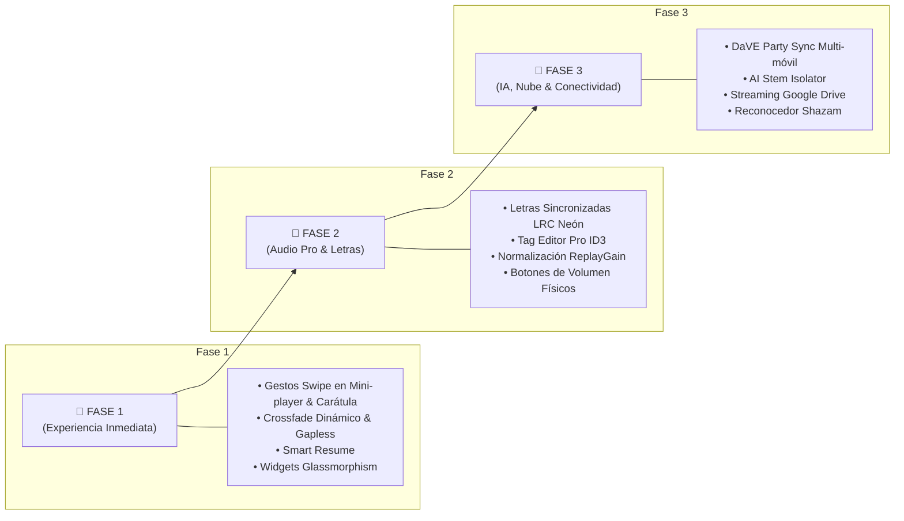

# 🚀 DaVE Player — Gran Plan Maestro & Roadmap de Funciones (2026)

Este documento contiene la **visión arquitectónica, catálogo completo de 46 mega funciones e innovaciones de vanguardia** planificadas para las futuras versiones de **DaVE Player** (Android).

---

## 📊 Diagrama Arquitectónico del Ecosistema

---

## 🎧 MÓDULO 1: Motor de Audio y Calidad Pro (Audio Engine)

1. **Crossfade Dinámico & Gapless Playback:**
   - Transición fluida con fundido cruzado regulable (1 a 10 segundos) entre pistas consecutivas.
   - *Silence Trimmer:* Algoritmo de detección que recorta automáticamente los silencios al inicio y final de las canciones descargadas.
2. **Normalización Inteligente de Volumen (ReplayGain / EBU R128):**
   - Ajuste de ganancia en tiempo real para mantener un volumen homogéneo entre diferentes archivos y fuentes sin saturación ni recortes.
3. **AI Stem Isolator (Separador de Instrumentos en Vivo):**
   - 4 pistas independientes controladas por deslizadores: **Voz, Batería, Bajo e Instrumentos**. Permite silenciar la voz para Karaoke perfecto o aislar instrumentos para músicos.
4. **Auto-EQ Inteligente por Género:**
   - Detección automática del estilo musical (Reggaeton, Trap, Rock, Pop, Electrónica, Acústico, Clásica) y auto-aplicación del perfil de ecualizador y refuerzo de bajos ideal.
5. **Modo DJ Armónico (Camelot & BPM Sync):**
   - Análisis de tempo (BPM) y clave tonal para mezclar de manera armónica la siguiente canción sin choques musicales.
6. **Perfiles Acústicos Calibrados por Auriculares:**
   - Ajustes DSP de compensación para *AirPods, Sony WH/WF, Galaxy Buds, JBL, Beats, KZ/IEMs* y altavoces portátiles.
7. **Salida Bit-Perfect USB DAC Directo:**
   - Acceso exclusivo al hardware de audio para transmitir audio PCM puro de 24-bit / 96-192 kHz (FLAC, ALAC, DSD) evitando el remuestreo del sistema operativo Android.
8. **Audio Ducking Suave:**
   - Atenuación progresiva del volumen al 20% durante notificaciones de llamadas, GPS o mensajes, con recuperación gradual.
9. **Simulador de Amplificador a Válvulas (Tube Amp Warmth):**
   - Generación de armónicos pares y saturación analógica cálida típica de los equipos Hi-Fi clásicos de válvulas.
10. **Audio 8D / 360° Spatializer Binaural:**
    - Algoritmo HRTF que hace rotar la música en un campo espacial tridimensional inmersivo para auriculares.
11. **Sub-Harmonic Bass Synthesizer:**
    - Generador de frecuencias subgraves (30-50 Hz) para dar cuerpo e impacto a canciones con bajos débiles.
12. **Compresor de Rango Dinámico (DRC / Modo Noche):**
    - Atenuación de explosiones y realce de diálogos/partes suaves para escuchar música de noche sin sobresaltos.

---

## 👆 MÓDULO 2: Experiencia de Usuario, Gestos y Control (UX & UI)

13. **Gestos Swipe en Mini-Player y Carátula:**
    - Deslizar horizontalmente sobre la barra inferior para saltar canciones.
    - Doble toque lateral en el reproductor para avanzar/retroceder 10 segundos.
    - Doble toque al centro para dar "Me gusta" con explosión de neón.
    - Deslizar hacia arriba para letras y hacia abajo para la cola.
14. **Control por Botones de Volumen Físicos con Pantalla Apagada:**
    - Mantener presionado Volumen + para siguiente pista y Volumen - para anterior, sin sacar el móvil del bolsillo.
15. **Smart Resume ("Continuar donde lo dejaste"):**
    - Banner emergente al abrir la aplicación para reanudar la última reproducción en el milisegundo exacto.
16. **Widgets de Pantalla de Inicio Glassmorphism & Cyberpunk:**
    - Widget 4x2 interactivo con ecualizador dinámico.
    - Widget 2x2 con vinilo giratorio en tiempo real.
    - Widget de letras sincronizadas en el escritorio.
17. **Mini-Reproductor Flotante PiP (Picture-in-Picture):**
    - Ventana flotante interactiva sobre WhatsApp, juegos y redes sociales.
18. **Motor de Temas Visuales (Theme Engine Pro):**
    - *Cyberpunk Neón (Predeterminado)*.
    - *OLED Pure Black* (ahorro extremo de energía).
    - *Aura Glass* (desenfoque traslúcido).
    - *Retro Vaporwave* (estética synthwave 80s).
    - *Lofi Cozy* (colores cálidos).
19. **Modo StandBy / Always-On Display OLED:**
    - Pantalla de mesa en negro absoluto con reloj digital neón y carátula para bases de carga.
20. **Scratching de Vinilo Interactivo & DJ Launchpad:**
    - Posibilidad de frenar, rayar o acelerar el disco de vinilo táctilmente con pads de sonido FX (*Airhorn, Scratch, Siren, Laser*).

---

## 🎤 MÓDULO 3: Letras, Metadatos y Gestión de Medios

21. **Letras Sincronizadas LRC en Tiempo Real:**
    - Desplazamiento automático con iluminación neón verso por verso estilo Apple Music y salto temporal al tocar cualquier estrofa.
22. **Editor de Etiquetas ID3 & Carátulas HD (Tag Editor Pro):**
    - Modificación directa en el archivo `.mp3`/`.m4a` del título, artista, álbum, año y asignación de imágenes HD.
23. **Reconocedor Acústico de Música Integrado ("DaVE Shazam"):**
    - Identificación por micrófono de canciones del ambiente para escuchar o descargar en Hi-Fi en un toque.
24. **Extractor de Video a MP3 & Grabador de Radio en Vivo:**
    - Conversión directa de videos locales a pistas MP3 de 320 kbps y grabación de fragmentos de emisiones de radio.
25. **Filtro Audiófilo Hi-Res & Limpiador de WhatsApp:**
    - Vista rápida de archivos FLAC/Lossless y botón de un toque para ocultar notas de voz y clips cortos de la galería.
26. **Mejorador de Carátulas por IA (AI Cover Enhancer):**
    - Reconstrucción de portadas de baja resolución a calidad 4K nítida.
27. **AI Audio Denoiser (Limpiador de Grabaciones):**
    - Supresión de ruido de fondo, estática y siseo en archivos antiguos.

---

## 🌐 MÓDULO 4: Nube, Inteligencia Artificial, Deporte y Conectividad

28. **DaVE Party Sync (Sincronización Multi-Móvil por Wi-Fi):**
    - Conexión de múltiples teléfonos a la misma red local para reproducir la misma canción simultáneamente como un sistema estéreo envolvente.
29. **Streaming Directo desde Google Drive / WebDAV / NAS:**
    - Reproducción de música alojada en la nube personal sin ocupar espacio en la memoria del teléfono.
30. **Copia de Seguridad en la Nube (Google Drive Backup):**
    - Respaldo de playlists, canciones favoritas, configuraciones del ecualizador e historial en archivos `.davebackup` o directo a Google Drive.
31. **Estadísticas de Reproducción Aesthetic (DaVE Stats):**
    - Gráficos de horas de escucha, top artistas y tarjeta visual exportable para estados de WhatsApp e historias de Instagram.
32. **Smart Sleep Timer con Sensor de Movimiento:**
    - Detección de inactividad prolongada en la noche para apagar la música con desvanecimiento de volumen progresivo (Fade-Out).
33. **Generador de Playlists por Texto / IA (AI Prompt Playlists):**
    - Creación automática de listas a partir de frases del usuario (*"música para entrenar"* o *"canciones para viajar de noche"*).
34. **Marcapasos Deportivo por BPM (BPM Running Pacer):**
    - Sincronización del tempo musical con la cadencia de pasos al caminar o correr usando el podómetro.
35. **Integración con Android Auto & Wear OS:**
    - Interfaz adaptada para pantallas de vehículos y control directo desde relojes inteligentes.
36. **Transmisión a Smart TV (Chromecast / DLNA):**
    - Envío de música y letras en pantalla grande a televisores y equipos de sonido.
37. **Limpiador de Canciones Duplicadas:**
    - Detección de canciones repetidas para liberar espacio en disco.
38. **Transferencia Offline por Código QR:**
    - Envío instantáneo de canciones y playlists de teléfono a teléfono por Wi-Fi Direct sin conexión a internet.
39. **Juego Multijugador "Adivina la Canción" (Blind Test):**
    - Modo de juego social para competir en grupo reconociendo fragmentos musicales.

---

## 📅 Fases de Implementación Sugeridas

---
*Documento generado y mantenido para el desarrollo de DaVE Player.*
